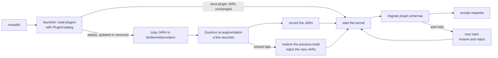

# Architecture overview

Mosaikit has four layers. Only the first one belongs to the platform; the others are plugins
with the same format and life cycle.

| Layer | Content |
|---|---|
| Kernel | Identity and accounts, organizations, localization, theming, plugin registry, shell, and cross-cutting services (events, jobs, storage, notifications, audit, data policy, entitlements, AI tool registry) |
| Apps | Plugins of kind `app`: they own a route, an entry of the app bar and a full screen, and may offer extension points |
| Extensions | Plugins that contribute to extension points of the kernel or of apps |
| Extensions of extensions | Plugins that extend other extensions |

## Modules

```
sdk/java (plugin API)  ←  kernel (Quarkus application: services, launcher, web UI)
    ↑                         ↑ serves
 plugins                   kernel/src/main/webui (web shell, built with sdk/js)
```

- `sdk/java` (artifact `mosaikit-kernel-api`) depends on the JDK only. ArchUnit enforces it. It
  is the only kernel artifact plugins may import, and with `sdk/js` it is what third parties
  receive ([sdk/README.md](../../sdk/README.md)).
- `kernel` is one Quarkus application packaged as mutable JAR. Its services live in
  `dev.mosaikit.kernel.core`: REST resources call services, never repositories. The launcher
  (`dev.mosaikit.launcher`) is part of the same JAR and prepares an installation before the
  kernel starts (see below). Its integration tests run against HTTP, PostgreSQL and Keycloak.
- The web shell (Lit, Vite) is in `kernel/src/main/webui`. The Maven build runs npm to build it
  before the kernel and packages the result in the kernel JAR, which serves it; in development
  mode Quinoa serves the sources with live reload.

## Plugins

A plugin is a package (`<name>.zip`, later signed) or a directory with the same content, with a
`manifest.yaml` that follows
[`plugin-manifest.schema.json`](../../sdk/java/src/main/resources/dev/mosaikit/kernel/api/plugin/plugin-manifest.schema.json).
Packages are copied into `plugins/` as they are; the kernel unpacks them into a work directory,
again only when they change. At start the kernel:

1. reads every manifest in the plugin directory;
2. validates it with the rules of `PluginManifests` (the same rules as the JSON Schema);
3. checks the platform range against the kernel version;
4. checks that the Java code of the plugin, if any, is built into the running kernel;
5. resolves requirements between plugins until no status changes;
6. marks each plugin `ACTIVE`, `INCOMPATIBLE`, `RESTART_REQUIRED` or `INVALID`, with the reasons;
7. migrates the database schema of every active plugin.

Installing a plugin takes effect at the next restart
([ADR-0004](../adr/0004-plugin-model-restart-and-packages.md)).

## Installation and start

Every distribution (installation, portable, container image) has the same layout:

```
<installation>/
├── mosaikit, mosaikit.cmd   the launcher scripts
├── README.md
├── config/     application.properties
├── plugins/    the installed plugins: packages (*.zip) or directories
├── data/       database and generated secrets (portable only)
└── bin/
    ├── mosaikit.ps1
    ├── kernel/ the kernel as Quarkus mutable JAR, with the UI and the launcher;
    │           providers/ holds the JARs of Java plugins, plugin-packages/ the unpacked packages
    ├── java/   Java runtime (portable only)
    └── pgsql/  PostgreSQL binaries (portable only)
```

The `mosaikit` script runs the launcher, then the kernel:



The new JARs of a rebuild are on probation until the kernel has started with them; the
launcher rolls back whatever prevented the kernel from rebuilding or starting
([ADR-0004](../adr/0004-plugin-model-restart-and-packages.md)).

## Frontend

The shell (Lit) asks the kernel for the frontends of active plugins, imports each ES module,
and calls its `activate(context)` function with a context from `@mosaikit/sdk`: the plugin's
contributions, the event bus, the current user and an authenticated `fetch`. Apps render as
custom elements named in their `rail.app` contribution (`launcher.app` is still read). A failing plugin never prevents the
others from loading.

## Communication between plugins

Plugins never call each other's code. They use channels of the kernel declared in the
manifest: events (publish/subscribe), typed services (request/response), shared context and
read-only data views. The browser event bus is available today; the others follow the
roadmap in `docs/requirements/`.

## Security

- Local accounts with PBKDF2-HMAC-SHA256 password hashes (600,000 iterations), constant-time
  comparison and equal timing for unknown usernames.
- Kernel roles: `platform-admin`, `organization-admin`, `organization-user`.
- Federated sign-in ([ADR-0011](../adr/0011-federated-identity-per-organization.md)): each
  organization may have its own Keycloak realm. The UI asks for the email first; the realm is
  chosen from the sub-domain or the email domain, and the person signs in there with the
  authorization code flow and PKCE. The kernel verifies the bearer tokens of each realm as a
  separate OIDC tenant created on first use, links them to an account of the organization, and
  grants only kernel roles of that organization. Local sign-in never depends on Keycloak.
- Every error is an RFC 9457 problem detail. Security headers on every response; strict CSP
  and HSTS in production.
- Plugin assets are served only for active plugins, only static web types, never the manifest,
  never outside the plugin directory.
